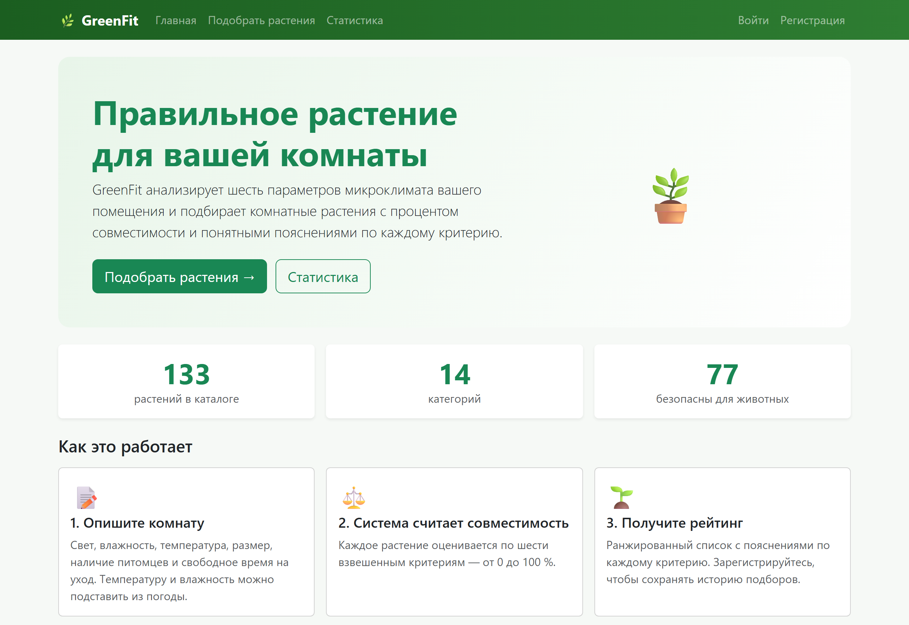
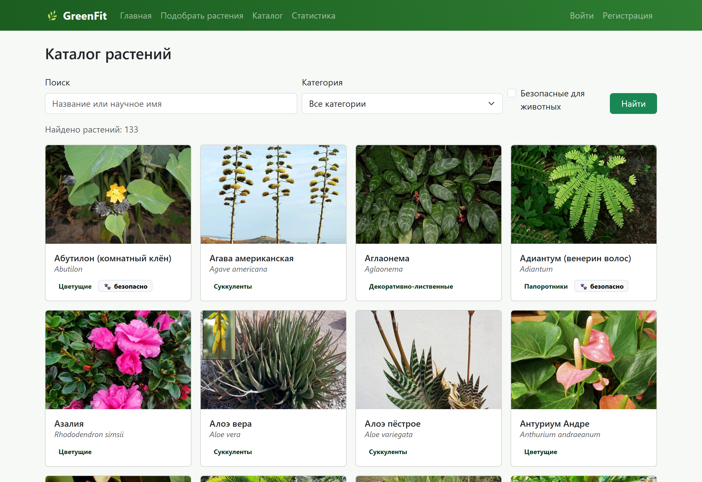
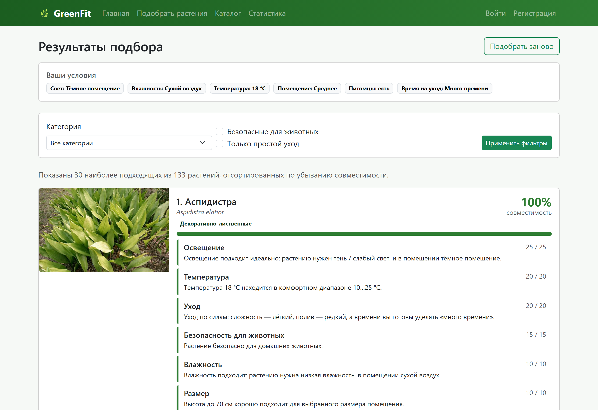
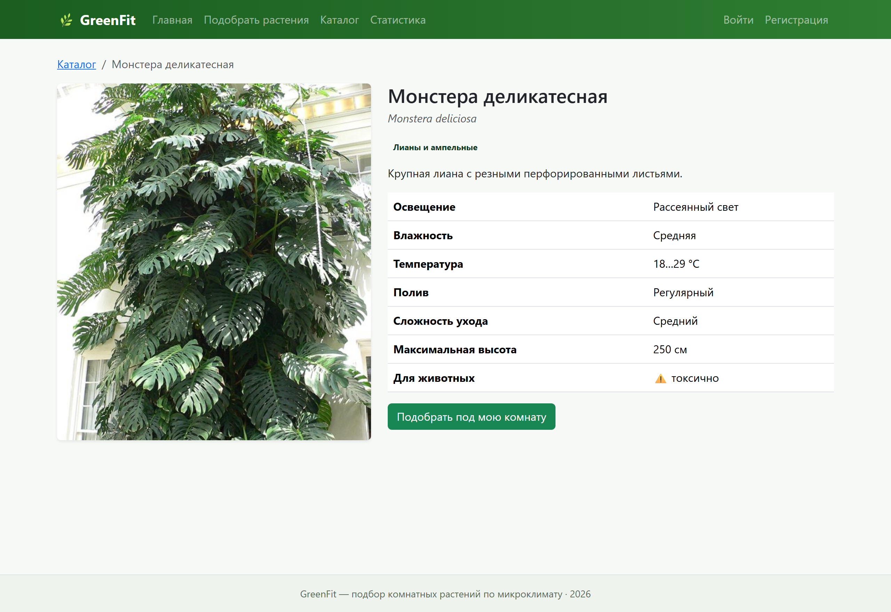
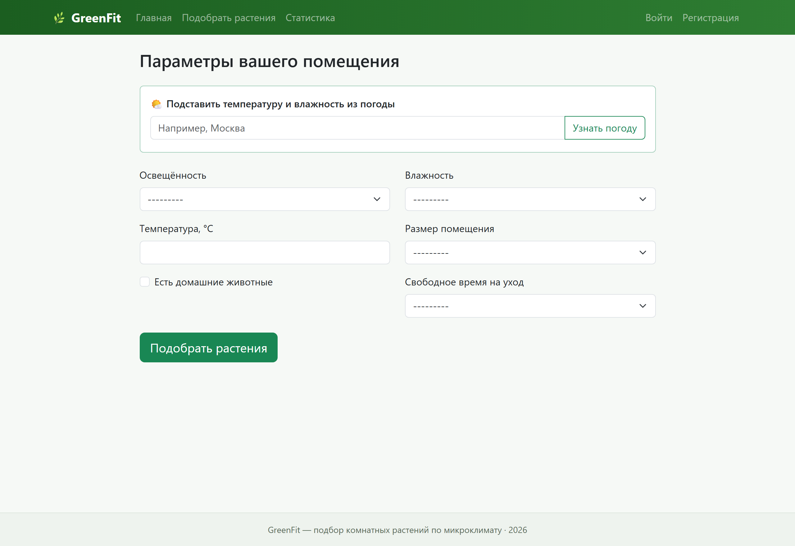
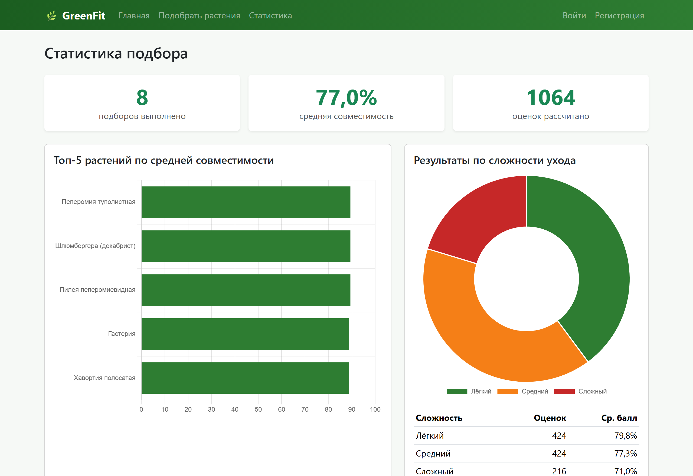

# 🌿 GreenFit

[](https://github.com/zawisla/GreenFit/actions/workflows/ci.yml)

**Подбор комнатных растений по микроклимату вашей квартиры.**

GreenFit анализирует шесть параметров помещения (освещённость, влажность, температуру,
размер, наличие питомцев и свободное время на уход) и рассчитывает **процент
совместимости** для каждого растения из каталога — с понятным объяснением по каждому
критерию. Это не просто фильтр каталога, а взвешенная оценка, которая помогает выбрать
растение, которое действительно приживётся.

🔗 **Демо:** **https://zawisla.pythonanywhere.com**

---

## Возможности

- 📝 Форма из 6 параметров помещения с серверной валидацией
- ⚖️ Расчёт совместимости 0–100 % по шести взвешенным критериям с пояснениями
- 🗂️ Каталог из **133 растений** (14 категорий) с поиском, фильтрами и страницей каждого растения
- 🖼️ Фотография для каждого растения
- 🎛️ Фильтры результатов: безопасные для животных, простой уход, по категории
- 🌤️ Автоподстановка температуры и влажности по городу через **Open-Meteo API** (AJAX)
- 📊 Страница статистики: средний балл, топ-5 растений, распределение по сложности
  ухода (**Pandas** + интерактивные графики **Chart.js**)
- 👤 Регистрация и личная история подборов
- 🛠️ Управление каталогом через админ-панель Django (поиск, фильтры)
- ✅ **32 автоматических теста** и непрерывная интеграция (GitHub Actions)

## Технологии

- **Python 3**, **Django 5.2 (LTS)**
- **Pandas 3** — аналитика
- **Requests** — обращение к Open-Meteo API
- **Bootstrap 5.3**, **Chart.js 4** — адаптивный интерфейс и графики
- **SQLite** (разработка) / **PostgreSQL** (продакшен) через `dj-database-url`
- **WhiteNoise** — отдача статики, конфигурация через переменные окружения

## Скриншоты

| Главная | Каталог с поиском и фильтрами |
|---|---|
|  |  |
| **Результаты с фото и пояснениями** | **Карточка растения** |
|  |  |
| **Подбор с погодой** | **Статистика (Pandas + Chart.js)** |
|  |  |

> Фотографии растений взяты из **Wikimedia Commons / Wikipedia** и используются в
> учебных целях.

## Запуск проекта локально

1. **Клонируйте репозиторий:**
   ```bash
   git clone https://github.com/zawisla/GreenFit.git
   cd GreenFit
   ```

2. **Создайте и активируйте виртуальное окружение:**
   ```bash
   python -m venv .venv
   # Windows:
   .venv\Scripts\activate
   # Linux / macOS:
   source .venv/bin/activate
   ```

3. **Установите зависимости:**
   ```bash
   pip install -r requirements.txt
   ```

4. **Настройте переменные окружения:**
   ```bash
   # Windows: copy .env.example .env
   cp .env.example .env
   ```
   Для локальной разработки достаточно `DJANGO_DEBUG=True` в файле `.env`.

5. **Примените миграции и наполните каталог:**
   ```bash
   python manage.py migrate
   python manage.py seed_plants   # 14 категорий, 133 растения с фотографиями
   ```

6. **Создайте администратора (для доступа в админ-панель):**
   ```bash
   python manage.py createsuperuser
   ```

7. **Запустите сервер:**
   ```bash
   python manage.py runserver
   ```
   Откройте http://127.0.0.1:8000/ — главная страница, а админ-панель доступна по
   адресу http://127.0.0.1:8000/admin/.

## Тесты

```bash
python manage.py test
```

## Структура проекта

```
GreenFit/
├── greenfit/          # настройки проекта и корневой URLconf
├── catalog/           # каталог: модели, админка, представления и шаблоны
│   ├── plant_data.py  #   133 растения в 14 категориях
│   ├── seed_images/   #   фотографии растений
│   └── management/    #   команда seed_plants
├── selector/          # подбор: RoomCondition, MatchResult, формы, представления,
│                      #   matching.py (алгоритм), weather.py (API), analytics.py (Pandas)
├── accounts/          # регистрация, вход, выход
├── templates/         # базовый шаблон и общие partials
├── static/            # CSS
├── .github/workflows/ # непрерывная интеграция (GitHub Actions)
├── requirements.txt
├── .env.example
├── TZ.md              # техническое задание
└── README.md
```

## Развёртывание

Проект развёрнут на **PythonAnywhere** (ссылка вверху): статика отдаётся через WhiteNoise,
все секреты вынесены в переменные окружения, поддерживаются PostgreSQL и MySQL через
`DATABASE_URL`. Перед публикацией задайте `DJANGO_DEBUG=False`, `DJANGO_SECRET_KEY`,
`DJANGO_ALLOWED_HOSTS` и выполните `python manage.py collectstatic`.

## Лицензия

Учебный проект.
